# 🌙 YorunoBrowser

> **The ultimate underground browser that will never pass the App Store** — A one-handed web browser & file manager for iOS

[](https://altstore.io)
[](https://altstore.io)
[](https://patreon.com)

---
## 📲 Installation
I support iOS 26.0 and above.(But i have only iPhone17(26.5.1))
YorunoBrowser is not on the App Store. Install via **AltStore**.
### EU / Japan Users (Recommended)
1. Install **AltStore PAL** on your iPhone [](https://altstore.io)
<a href="altstore://source?url=https://raw.githubusercontent.com/C0A2518617/YorunoBrowser_Official/main/source.pal.json">
  
</a>
2. Add source in AltStore PAL with the URL
3. Install from AltStore
* Update is automatic. Just open AltStore and check for updates when a new version is released.

### Global
1. Install **AltServer** on your PC
2. Install **AltStore** on your iPhone
3. Download the `.ipa` file from https://github.com/C0A2518617/YorunoBrowser_Official/releases
4. Install the IPA via AltStore

* i don't support iPad. If you want, let's find .ipa for iPad at this repository.
* Update is not automatic. You need to download the new .ipa and install it via AltStore every time.

## ✨ Key Features

### 🌐 Browser
- **Optimized for one-handed use** — Gesture-enabled UI consolidated at the bottom with top/bottom padding, so your thumb handles everything
- **Forced dark mode** — Automatically darkens white-heavy sites. Easy on the eyes for late-night browsing
- **Tab groups** — Organize tabs by purpose
- **Content saving** — Download media like `.ts` / `.mp4` with a single tap
- **Ad blocker** — Removed at the CSS level. Supports custom per-site exceptions
- **Popup & transparent overlay blocker** — Automatically eliminates intrusive elements
- **SelectToSearch** — A Search button appears when you select text. Search Google with a custom keyword (e.g., `{text} full episode`)

### 📚 Me (My Page)
- Bookmarks / Browsing history / Download history
- Download history lets you review files chronologically and view detailed error messages with copyBtn (e.g., "HTTP 404: get-playlist-metadata)

### 📁 File / Explorer
- PC-style list view (filterable by FileType & Size)
- **File conversion** — Compress, resize, and more — all within the app
- **Multiple sort options** — Size / Name / Date / LikeTime count (ASC/DESC)
- **Pitch-correction encoding** — Supports voice changer removal. Check pitch in audio/video with the pitch checker and apply bulk changes

### 🖼️ File / Grid
- Quickly browse images, videos, and audio in a grid layout with gesture navigation

### ▶️ File / ContentViewer
- Swipe left/right to navigate through files
- **LikeTime (timestamps)** — Jump to your favorite scenes anytime
- **25% skip buttons** — Move playback position without reaching to the screen edge (prevents dropping your phone)

### 📺 File / YoruTube (Coming Soon)
- Browse local files in a YouTube-like UI
- Organize content by creator folder

### ⚙️ Settings
- Settings screen with clear descriptions — no guesswork
- `SearchEngine` / `ThemeColor` / `Icon` / `ForceDarkMode` / `Gesture` / `AdsCleaner` / `ExceptionSite` / `ForceZoom` / `BlockSite` / `SelectToSearch` / `PaddingForOneHand` / `ContentViewer` / `ProximityGesture` / `DataBackup` / `Legal` / `Version`
* Search Engine : Google / DuckDuckGo / Bing / YahooJapan
* Theme Color: Blue/Red/Green/Orange/Purple/Pink/Yellow/16bitBlue?/turquoise blue/lightblue
* Icon : 4 Icons and more
* ForceDarkMode : off/smart/Allinvert, exception page
* Gesture : Left/RightEdgeSwipe
* AdsCleaner : OnOff, ExceptionSite ,RuleVersion,LastUpdate/Update
* ForceZoom : OnOff
* BlockSite : Pages
* SelectToSearch : OnOff, HapticFeedback, Keyword
* PaddingForOneHand : OnOff, ExceptionSite
* ContentViewer : Using a mini-player in a video/audio
* ProximityGesture : OnOff, URL
* DataBackup : Backup/Restore(Only LikeTime. If you want bookmarks/histories.json, open yorunobrowserFolder in Files.)
* Legal : Links
* Version : Current Version

### 💳 Billing
- Check Your Plan and Remain of downloads
- YorunoSubscriptionCard : Beautiful Visual and Amount of monthly downloads, PlanName
- Warning: Get 100times at firstboot, times cannot be refunded, No charge in failed.
- Subscriptions : Free / Standard / Pro / Premium / Supporter(Differences and prices)
- Download features infomation
- Buttons : PatreonLink / UsageHistory
---

## Screenshots

### 🌐 BrowserTop (PaddingForOneHand / Scroll padding)

<table>
  <tr>
    <td>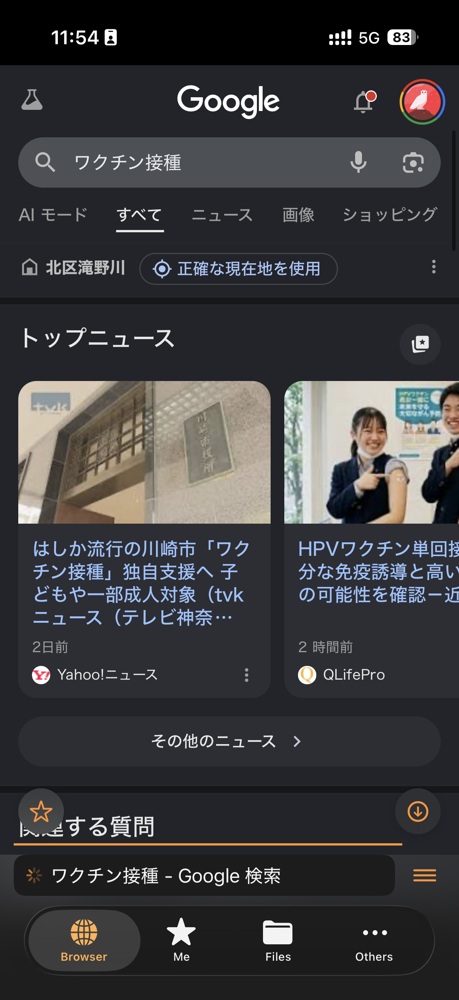</td>
    <td>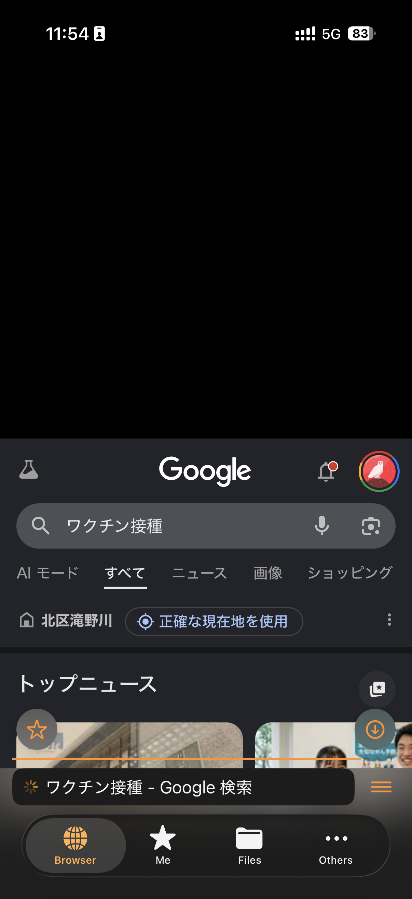</td>
  </tr>
</table>

### 📥 Download Feature Demo (demo01)

<details>
  <summary>Open demo screenshots</summary>
  <br>
  <table>
    <tr>
      <td>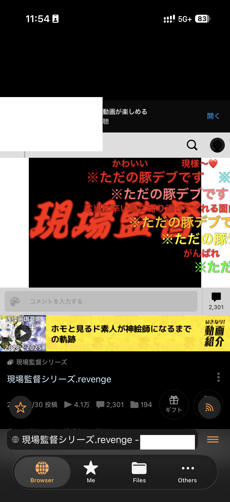</td>
      <td>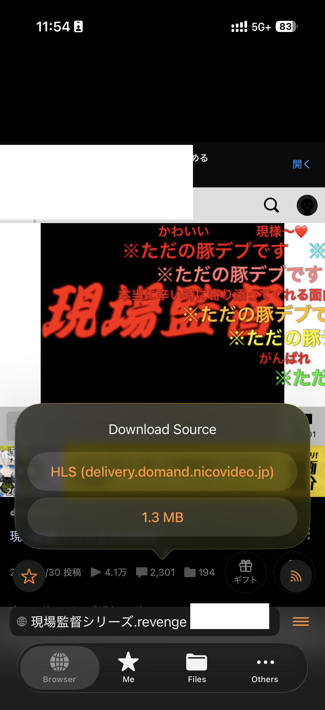</td>
      <td>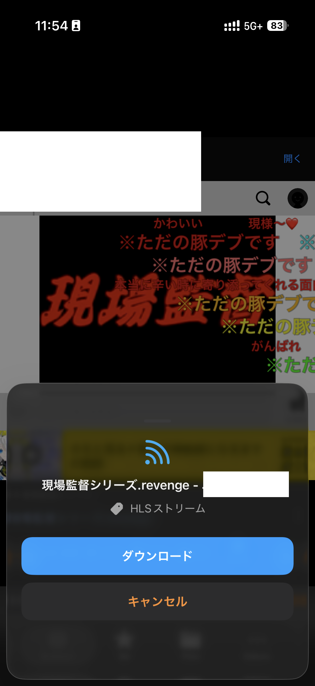</td>
    </tr>
    <tr>
      <td>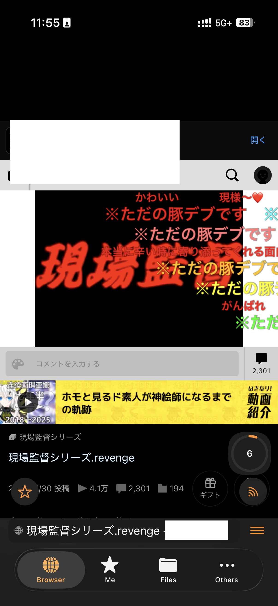</td>
      <td>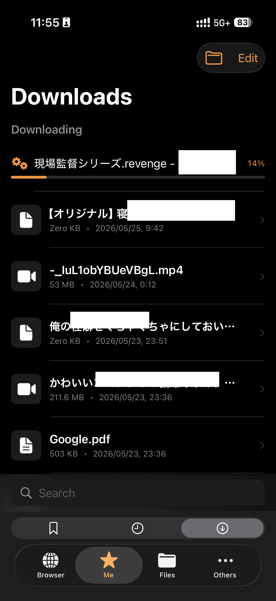</td>
      <td>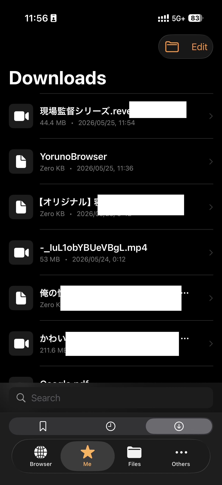</td>
    </tr>
    <tr>
      <td>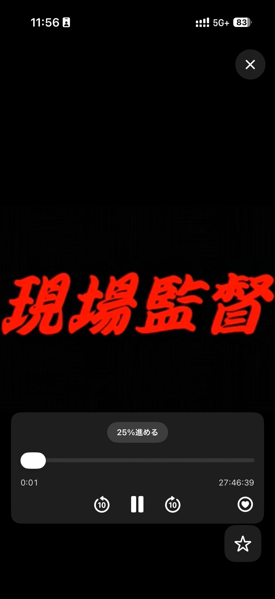</td>
      <td></td>
      <td></td>
    </tr>
  </table>
</details>

### 📚 Bookmarks / ⚙️ Settings / 💳 Billing

<table>
  <tr>
    <td>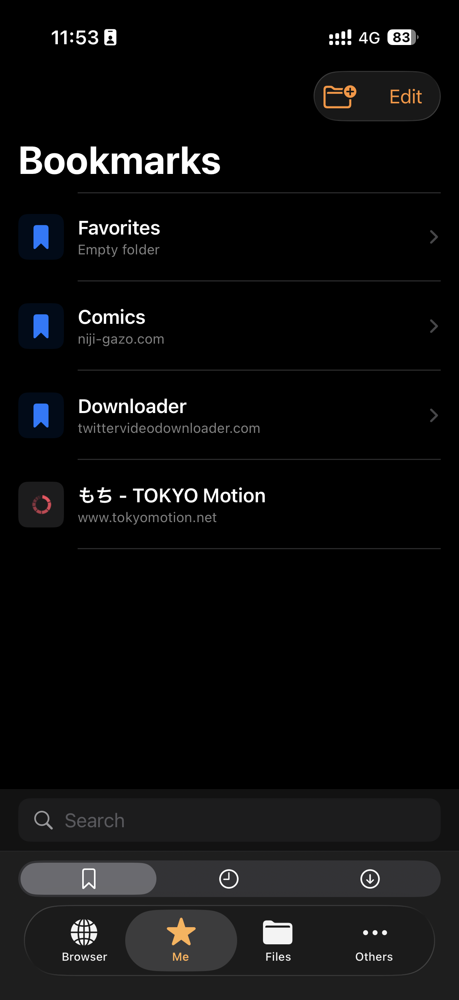</td>
    <td>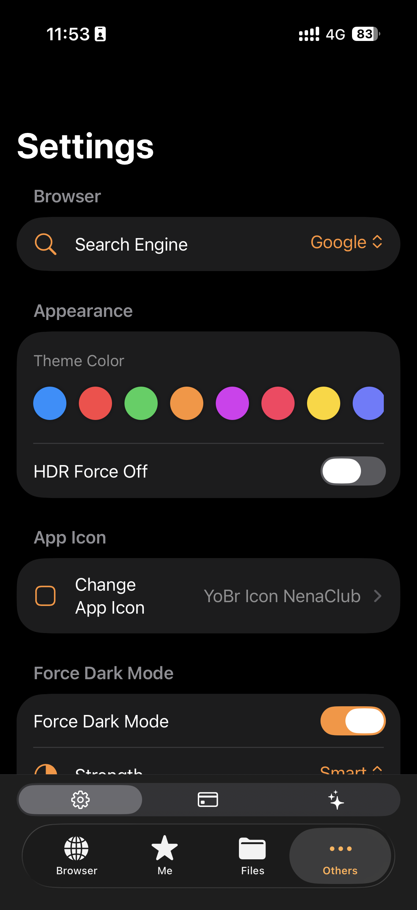</td>
    <td>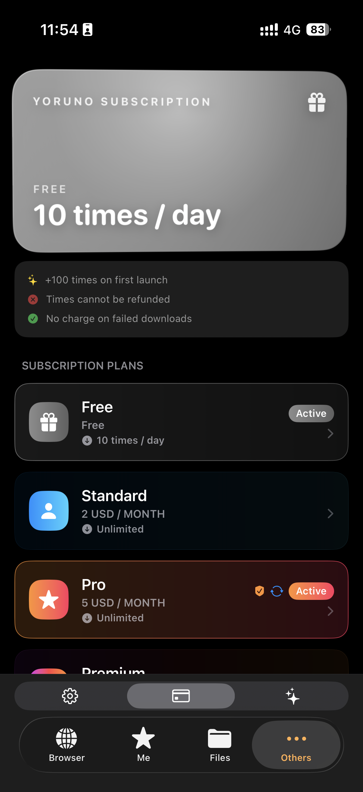</td>
  </tr>
</table>

## Download Feature

Save videos, audio, and multiple images directly from supported sites.

```
1. Tap the DL button
2. Select the file
3. Confirm the filename and type, then Execute / Cancel
4. Download runs (failed downloads do not consume your DL count)
```
* In many cases, you should play the video before tap the DL button.

### Supported Sites
| Status | Example Sites |
|--------|---------------|
| ✅ Supported (HLS/MP4) | General HLS / MP4 Streams (e.g., Public video platforms, Major web media sites, etc.) |
| 🔗 Redirect (External DL) | YouTube |
| ⚠️ NoSound | X(Twitter) |
| ❌ Unsupported (DRM) | Netflix / Amazon Prime Video, etc. |

> **Error Code Reference**
> - `400` — DL system error
> - `404` — Broken link
> - `500` — Blocked by the site

※ Supported sites may change without notice.

---

## 💰 Plans & Pricing

Available as a monthly subscription on Patreon.

| Plan | Price | Content DL | Additional Settings | File Conversion | Theme | Discord |
|------|-------|:----------:|:-------------------:|:---------------:|:-----:|:-------:|
| **Free** | $0 / mo | 10 DL/day | - | — | — | — |
| **Standard** | $2 / mo | Unlimited | - | — | — | — |
| **Pro** | $5 / mo | Unlimited | ✅ | ✅ | — | — |
| **Premium** | $20 / mo | Unlimited | ✅ | ✅ |  ✅ | ✅  |
| **Supporter** | $100 / mo | Unlimited | ✅ | ✅ | ✅ | ✅ |
* LINK: https://www.patreon.com/cw/YorunoBrowser
* Additional Settings : BlockSiteException / PaddingForOneHandException / AdsCleanerException and more. Available from Pro and above.
* File Conversion : Compress, resize, and more. Available from Pro and above.
* Theme : Change the theme color and app icon. Available from Premium and above.
* Discord : Everyone can join the Discord server, but only check-in supporters can talk to the developer.
* <strong>Recommended: Standard Plan</strong> — All the core features that make this browser great — one-handed operation and more — are available for free. But if you want unlimited video downloads, this is the plan for you. When downloading, you often have to choose between Unknown SD/HD, HLS, and GIF. If you pick wrong, you don't have to wait until tomorrow — no limit means no risk of the video disappearing by the time you come back.
* Only Standard Plan has a free trial for 7 days.
---

## FAQ
1. **Why isn't it on the App Store?** — Many features conflict with Apple's guidelines, making App Store distribution impossible.
2. **It's Chinese-made, you're stealing my data, you spy!** — The developer is an individual living in Japan. The source is private, but no data is collected. Even if it were, the storage costs would make it completely impractical.
3. **Can I use it for free?** — Yes, there is a free plan. However, it has a download limit, so frequent users are encouraged to subscribe to a paid plan.
4. **Is it illegal?** — This software is simply a browser and does not promote illegal activity. Please use it legally and at your own responsibility.
5. **Android version?** — Currently iOS only, but an Android version may be considered in the future. *(Seriously though — Android users spend less, and the app would just get cracked with ModApks, so probably not.)*
6. **Windows/Mac version?** — Would be nice to support someday, but not many people browse on a PC for... *that*.
7. **Can I decompile it and unlock paid features for free?** — F**K YOU. Are you killing me?
8. **Refund?** - Please check patreon's refund policy.

## 📄 License
This software is proprietary. Unauthorized reproduction or redistribution is prohibited.
Privacy Policy: https://c0a2518617.github.io/YorunoBrowser_Official/PrivacyPolicy.md
Terms of Service: https://c0a2518617.github.io/YorunoBrowser_Official/TermsOfService.md
License : https://c0a2518617.github.io/YorunoBrowser_Official/License.md